# WaveTop user guide

**See what's on the air.** A walk through every screen. Screenshots show all three themes; pick yours
under Settings → General.

- [The top bar](#the-top-bar)
- [Devices](#devices)
- [Device details](#device-details)
- [Map](#map) — street map and radar
- [Channels](#channels)
- [Drives](#drives) — wardriving, replaying, sharing
- [Sending to NetSeer](#sending-to-netseer)
- [Log](#log)
- [Settings](#settings)

## The top bar

Always at the top: the WaveTop logo, how many devices are listed and what's scanning right now, and
three controls:

- **Live / Paused** — live scanning on or off. Live, WaveTop scans Wi-Fi about every 35 seconds (the
  fastest Android allows without refusing scans) and Bluetooth in 12-second windows.
- **Drive** — start a wardrive from any screen. While recording it turns red and shows the elapsed
  time; tap it to stop.
- **Cog** — Settings. A dot on it means a new version is out (see [Updates](#updates)).

WaveTop only scans while it's on screen, unless a wardrive is recording.

## Devices

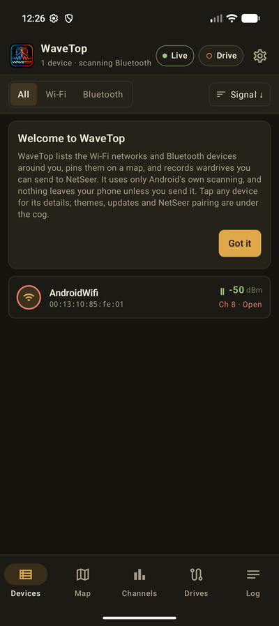

Every Wi-Fi access point and Bluetooth device WaveTop has heard. Each row shows:

- a badge for the kind of device (Wi-Fi or Bluetooth; a red ring means an **open** Wi-Fi network),
- its name and MAC address, with the vendor when it's known,
- the signal in dBm with a sparkline of recent readings (green strong, amber fair, red weak),
- for Wi-Fi, the channel and security (open networks in red, WEP/WPA in amber, WPA3 in green).

**All / Wi-Fi / Bluetooth** filters the list. The sort button orders it by signal, name, type,
security, channel or last seen; choosing the same one again flips the direction. Devices not heard
for a minute fade; ones not heard for ten minutes drop off the list.

## Device details

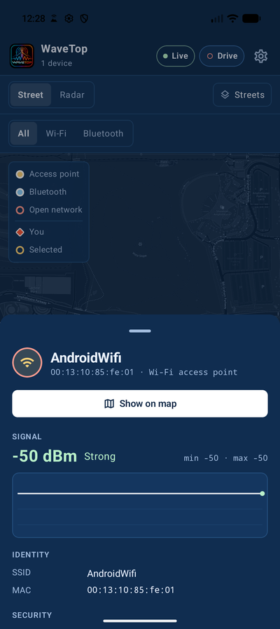

Tap any device. The sheet shows its signal now, its weakest and strongest, a graph of recent
readings, its identity, security, channel and frequency, vendor, and when it was first and last
heard — plus where it was heard loudest, if the phone had an accurate GPS fix then.

**Show on map** jumps to the street map and rings the device; if it has no position yet, **Show on
radar** does the same on the radar.

## Map

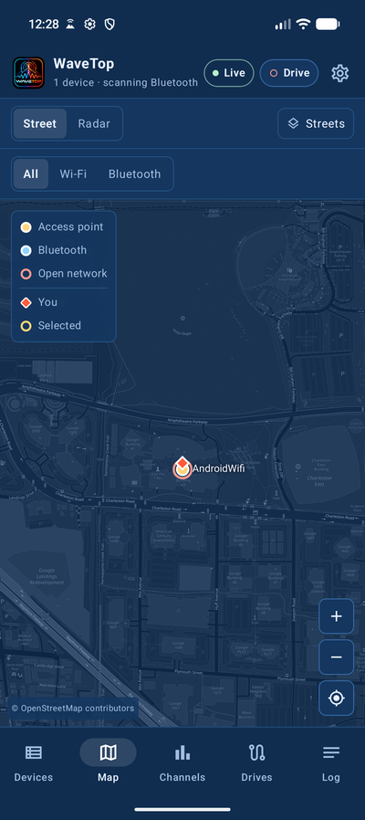 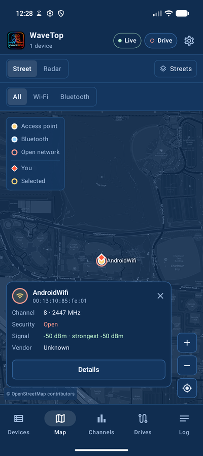

**Street** pins every device where its signal was strongest — after you've walked or driven past it,
that's roughly where it is. You're the orange-red diamond, with a faint circle for GPS accuracy.

- The **legend** (top left) names the colours: access points, Bluetooth, open networks (red ring), you,
  and the selected device.
- **+ / −**, **centre on me** and **fit everything** are bottom right.
- **Tap a pin** for a card with its channel, security, signal and vendor; **Details** opens the full
  sheet. If several pins sit under your finger, a list opens instead so you can pick the right one —
  or **Zoom in** to pull them apart.
- **Basemap** (top right): **Streets** (OpenStreetMap, tinted to your theme and cached once seen) or
  **No basemap**.
- The six strongest devices get name labels (Settings → General → Map to turn that off).

Pins only use a fresh, accurate GPS fix (within 50 m, taken within 15 seconds of hearing the device),
so a stale or coarse location never pins a device somewhere you haven't been.

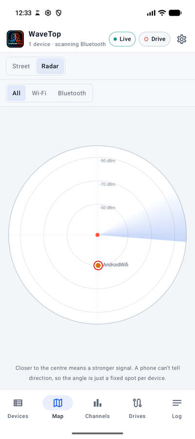

**Radar** puts you in the middle: the closer a dot, the stronger the signal. A phone can't tell which
direction a signal comes from, so each device just keeps a fixed angle. Tap a dot for its details.

## Channels

How many access points sit on each channel of the 2.4, 5 or 6 GHz band, coloured by the strongest one
heard there. Pick the band at the top. Crowded channels are the ones to avoid for your own network.

## Drives

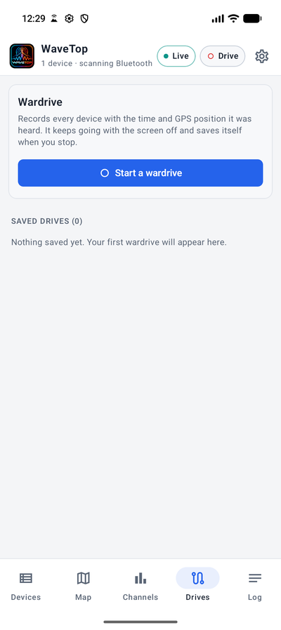

A **wardrive** records every sighting with its time and GPS position.

1. Tap **Start a wardrive** (or **Drive** in the top bar) and give it a name.
2. Walk or drive. WaveTop keeps recording with the screen off and shows a notification with the time
   and counts, with **Stop & save**. (Some phones pause Bluetooth LE scanning while the screen is off;
   Settings → General can keep the screen on while driving.)
3. Tap **Stop and save**. The drive is saved under its name and listed below.

If a drive ends without being stopped (the phone died), it's still saved up to its last sighting and
marked **Interrupted**.

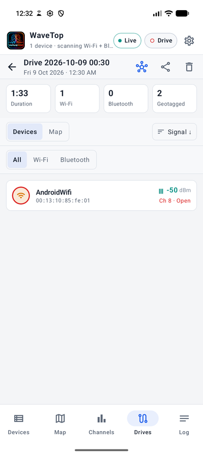 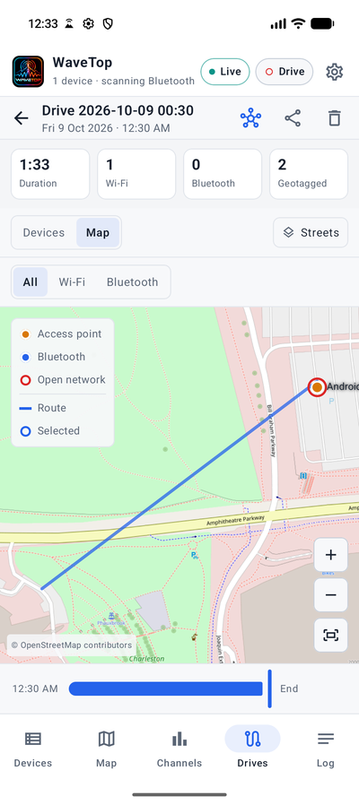

Open a saved drive to see how long it ran, how many Wi-Fi and Bluetooth devices it found, and how many
sightings are geotagged. **Devices** lists them; **Map** draws the route you took and pins every device,
and the **time slider** underneath replays the drive — slide it back to see what had been heard by then.

The buttons at the top **send it to NetSeer**, **share** it, or **delete** it. Share offers:

| Format | For |
| --- | --- |
| WiGLE CSV | Every geotagged Wi-Fi and Bluetooth sighting. Opens in NetSeer; uploads to wigle.net. |
| Kismet netxml | Wi-Fi networks with GPS, for Kismet tools. |
| WaveTop raw CSV | The complete recording as stored on the phone. |

## Sending to NetSeer

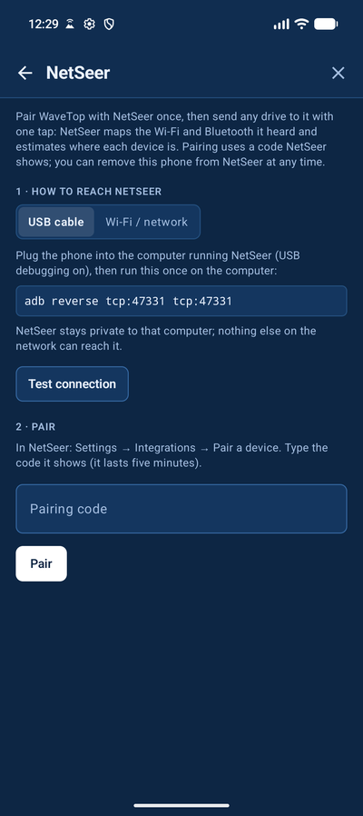 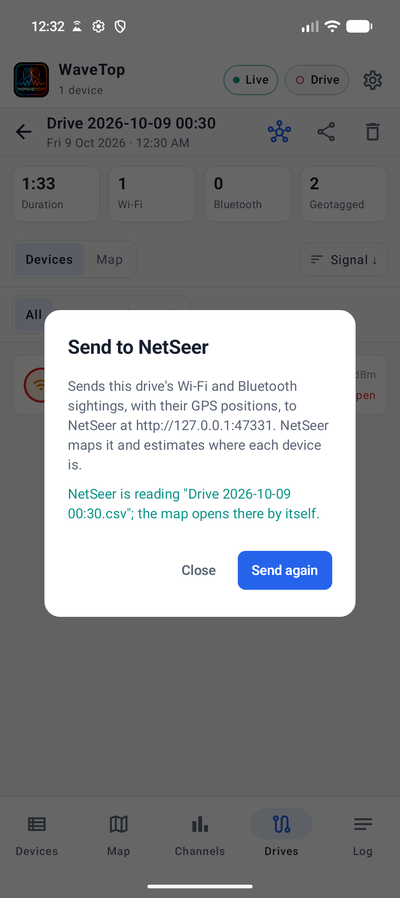

Pair once (**Settings → NetSeer**):

1. **How to reach NetSeer**
   - **USB cable** — plug the phone into the computer running NetSeer (USB debugging on) and run
     `adb reverse tcp:47331 tcp:47331` on the computer once. NetSeer stays private to that computer.
   - **Wi-Fi / network** — in NetSeer turn on **Settings → Integrations → Allow devices on my
     network**, then type the address it shows.

   **Test connection** checks that NetSeer answers.
2. **Pair** — in NetSeer, **Settings → Integrations → Pair a device** shows a six-digit code (good for
   five minutes). Type it and tap **Pair**.

Then open any drive and tap the NetSeer button → **Send**. NetSeer reads it and opens the map on its
own, with each device placed from its GPS sightings. **Unpair** forgets NetSeer on the phone; remove the
phone in NetSeer's Integrations to revoke it there too.

## Log

Everything WaveTop noticed, newest first: new devices, Wi-Fi or Bluetooth switching off, Android
limiting scans, the first GPS fix, drives starting and saving, sends to NetSeer.

## Settings

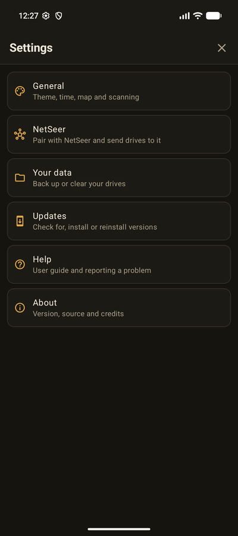

The cog opens Settings. Pick a section; the back arrow returns to the list.

### General

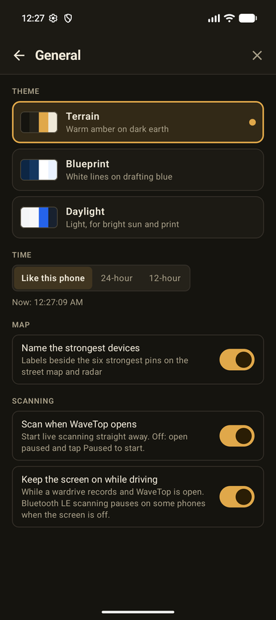

- **Theme** — **Terrain** (warm amber on dark earth), **Blueprint** (white lines on drafting blue) or
  **Daylight** (light, for bright sun). The same three as NetSeer.
- **Time** — like this phone, 24-hour, or 12-hour.
- **Map** — name the strongest devices on the maps.
- **Scanning** — start scanning when WaveTop opens; keep the screen on while a wardrive records.

### NetSeer

See [Sending to NetSeer](#sending-to-netseer).

### Your data

How many drives are saved and how much space they take. **Back up all drives** shares a `.zip` of
every drive (keep it before uninstalling or changing phones). **Delete all drives** and **Reset
settings** start over; neither can be undone.

### Updates

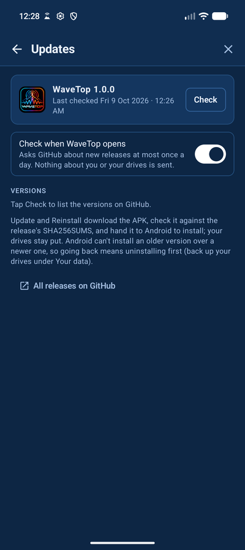

The card shows the installed version; **Check** asks GitHub for the list of releases.

- **Update** (on a newer release) downloads it, checks it against the release's checksum, and hands it
  to Android to install. The first time, Android asks you to allow WaveTop to install apps. Your drives
  are kept, and a notification says when the new version is ready.
- **Reinstall** puts the current version back on.
- **Check when WaveTop opens** asks GitHub at most once a day; when something new is out, a dot appears
  on the cog and **New** beside Updates.

Android can't install an older version over a newer one, so going back means uninstalling first —
back up your drives under Your data before you do.

### Help and About

**Help** links to this guide, the release notes, and reporting a problem on GitHub. **About** shows the
version, the Android version, the source, and credits.
